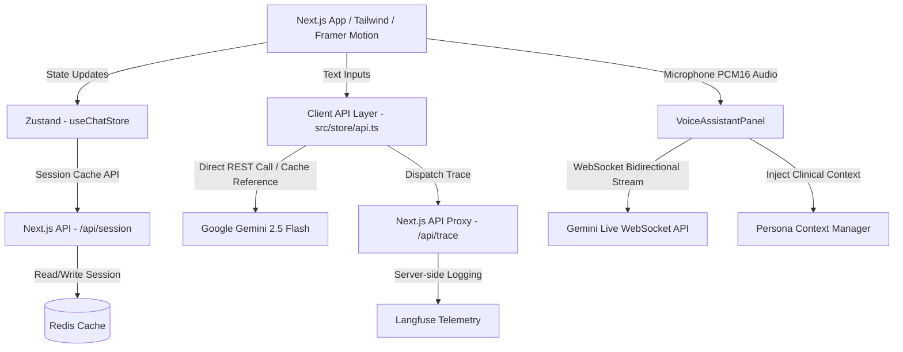

# YHealth AI — Conversational Metabolic & Wellness Assistant

YHealth AI is a premium, conversational metabolic and preventive wellness landing application. Drawing design inspiration from clean, minimalist interfaces (e.g., Claude AI), it delivers a high-trust conversational entry point for patient onboarding and health coaching.

The application combines a multi-stage clinical profiling state machine, context-caching optimizations to control API costs, real-time bidirectional WebSocket voice consultations, and secure server-side telemetry.

---

## 🏗️ System Architecture

YHealth AI leverages Next.js, Redis, and Google Gemini API (including standard LLM and Live API WebSockets) to orchestrate a fast, responsive, and secure experience.



---

## 🚀 Deep-Dive Technical Pillars

### 1. Real-Time Live Voice Assistant
The Voice Assistant allows hands-free, natural-sounding consultations using the `@google/genai` Live API over WebSockets:
* **Audio Input Pipeline**: Captures user microphone input at a **16kHz sample rate** via `navigator.mediaDevices.getUserMedia` and a Web Audio `AudioContext`. Audio is chunked, downsampled, converted to base64 PCM 16-bit frames, and streamed via WebSockets using `session.sendRealtimeInput`.
* **Audio Playback Scheduler**: Receives raw base64 PCM 16-bit audio output from Gemini Live at a **24kHz sample rate**. Audio is converted to `Float32Array` buffers and scheduled sequentially in the Web Audio context.
* **Smart Interruption Handling**: Instantly stops the active speaker buffer if Gemini emits a `serverContent.interrupted` message (when the user starts speaking over the assistant). The scheduler calls `clearAudio()` to immediately silence playback.
* **RMS Amplitude-Driven Canvas Waveform**: Renders a premium, smooth multi-layered sine wave on a high-DPI `<canvas>`. The wave height (amplitude) and speed dynamically shift in real-time based on the Root Mean Square (RMS) value of the speaker playback and microphone input.
* **Wake Lock Protection**: Uses a custom `useWakeLock` hook to request a Screen Wake Lock. This keeps the user's mobile screen awake and prevents WebSocket disconnections due to device sleep during long voice calls.

### 2. Text-to-Voice Context Synchronization
To maintain a continuous, multi-modal conversation thread:
* **Zustand State Extraction**: When the user opens the Voice Panel, the component extracts the active chat session's text messages from the Zustand store.
* **System Prompt Injection**: The last 10 messages of text history are serialized into a transcription block:
  ```text
  [User]: ...
  [Assistant]: ...
  ```
  This block is appended to the connection-level `systemInstruction` configurations, giving the Gemini Live WebSocket model full awareness of the preceding text conversation.
* **Aesthetic Transition Welcome**: Inside the connection's `onopen` callback, if a text history is detected, it triggers a custom prompt: *"User transitioned from text chat to voice. Acknowledge this transition and their latest point in the text chat in a warm, brief 1-sentence welcome."* This prevents generic, repetitive greetings.

### 3. Google GenAI Context Caching Heuristics
When a patient is verified, their entire clinical profile (clinical history, CGM glucose levels, laboratory results, active medications) is loaded. To optimize costs and latency:
* **Token Threshold Evaluation**: We evaluate the length of the system prompt plus clinical context. Since Gemini context caching requires a minimum threshold of 2,048 tokens, the app checks if the instruction length exceeds **8,500 characters** (roughly 2,100 tokens).
* **REST Caching Registry**: If the instruction length qualifies, we hit the `/v1beta/cachedContents` endpoint to register the cache resource, returning a `cacheName`.
* **Cache Reuse**: We save `cacheName` in an in-memory cache registry keyed by a hash of the system instructions. Subsequent user requests use the `cachedContent` ID parameter, saving up to 50% on input token costs for multi-turn chats.

### 4. Secure Langfuse Telemetry Proxy
Rather than exposing sensitive analytics keys to the client:
* **Next.js Server Endpoint**: Exposes `/api/trace` to process client-side events. This endpoint reads the private `LANGFUSE_SECRET_KEY` strictly on the server side.
* **LLM Hook Integration**: Every time a user gets a chat response (`fetchGeminiResponse`), completes a validator turn (`verifyUserData`), or triggers a landing page greeting (`fetchGreetingResponse`), a non-blocking `fetch('/api/trace')` post request is dispatched asynchronously.
* **Observed Metrics**: Tracks input/output transcripts, model configuration parameters, and the exact token usage breakdown (`usageMetadata`). It groups chat sequences under a single `sessionId` (linked to `activeChatId`) to help analyze multi-turn conversations.

---

## 📂 File-by-File Directory Guide

### Core App Layout & Entry
* **[`src/app/page.tsx`](file:///home/vishal_kumar/Desktop/chatbot/chatbot/src/app/page.tsx)**: Main landing layout. Implements the Claude-style dynamic greeting engine, handles responsiveness breakpoints, and anchors the chat frame container.
* **[`src/app/globals.css`](file:///home/vishal_kumar/Desktop/chatbot/chatbot/src/app/globals.css)**: Stylesheet containing theme transitions, customized glassmorphic variables, and keyframe animations.

### UI Components
* **[`src/components/ChatInput.tsx`](file:///home/vishal_kumar/Desktop/chatbot/chatbot/src/components/ChatInput.tsx)**: The interaction capsule containing typing placeholders, quick action chips, and triggers for the voice panel.
* **[`src/components/ChatMessage.tsx`](file:///home/vishal_kumar/Desktop/chatbot/chatbot/src/components/ChatMessage.tsx)**: Message bubble formatter. Formats code blocks, tables, and renders custom `[HealthCardsGrid: ...]` blocks as inline diagnostic grids.
* **[`src/components/VoiceAssistantPanel.tsx`](file:///home/vishal_kumar/Desktop/chatbot/chatbot/src/components/VoiceAssistantPanel.tsx)**: Voice modal implementation. Manages Web Audio context pipelines, WebSocket streaming, and RMS canvas rendering.
* **[`src/components/persona.ts`](file:///home/vishal_kumar/Desktop/chatbot/chatbot/src/components/persona.ts)**: Speech persona file instructing the model on rhythm, tone, filler words, and professional conversational habits.
* **[`src/components/TourTooltip.tsx`](file:///home/vishal_kumar/Desktop/chatbot/chatbot/src/components/TourTooltip.tsx)**: Guided walk-through overlay highlighting chat options, voice inputs, and verification processes.

### State & API Integrations
* **[`src/store/chatStore.ts`](file:///home/vishal_kumar/Desktop/chatbot/chatbot/src/store/chatStore.ts)**: Global Zustand store. Controls onboarding step machines, message indices, and manages Redis persistence calls.
* **[`src/store/api.ts`](file:///home/vishal_kumar/Desktop/chatbot/chatbot/src/store/api.ts)**: API layer. Houses raw Gemini fetch calls, context caching check heuristics, and Langfuse tracing triggers.
* **[`src/store/campaign-config.ts`](file:///home/vishal_kumar/Desktop/chatbot/chatbot/src/store/campaign-config.ts)**: Config maps storing taglines, CTA names, and welcome templates for specific programs (e.g., Diabetes, Hypertension).

### Clinical Patient Persona Layer
* **[`src/persona/PersonaManager.ts`](file:///home/vishal_kumar/Desktop/chatbot/chatbot/src/persona/PersonaManager.ts)**: Controls retrieval, parsing, and modification of active patient files.
* **[`src/persona/PersonaContextBuilder.ts`](file:///home/vishal_kumar/Desktop/chatbot/chatbot/src/persona/PersonaContextBuilder.ts)**: Formats clinical structures into markdown blocks for LLM system prompts.
* **[`src/persona/patientMock.ts`](file:///home/vishal_kumar/Desktop/chatbot/chatbot/src/persona/patientMock.ts)**: Mock patient profile holding blood pressure trends, CGM reports, and active medications.
* **[`src/persona/parsers/`](file:///home/vishal_kumar/Desktop/chatbot/chatbot/src/persona/parsers)**: Individual parsers extracting specific details (e.g., `cgm.parser.ts`, `labs.parser.ts`, `medication.parser.ts`).

### Infrastructure & Proxies
* **[`src/app/api/trace/route.ts`](file:///home/vishal_kumar/Desktop/chatbot/chatbot/src/app/api/trace/route.ts)**: Langfuse server tracing proxy.
* **[`src/app/api/session/route.ts`](file:///home/vishal_kumar/Desktop/chatbot/chatbot/src/app/api/session/route.ts)**: Saves and restores Zustand chat state to and from Redis.
* **[`Dockerfile`](file:///home/vishal_kumar/Desktop/chatbot/chatbot/Dockerfile)**: Multi-stage Docker config packaging Next.js into a standalone build.
* **[`docker-compose.yml`](file:///home/vishal_kumar/Desktop/chatbot/chatbot/docker-compose.yml)**: Orchestrator running Next.js and Redis.

---

## ⚙️ Environment Variables Reference

Configure these environment variables in your `.env` or `.env.local` file:

| Variable | Scope | Description | Example / Fallback |
| :--- | :--- | :--- | :--- |
| `NEXT_PUBLIC_GEMINI_API_KEY` | Client & Server | Google Gemini developer key for REST and WebSocket calls | `AIzaSy...` |
| `NEXT_PUBLIC_BACKEND_URL` | Client & Server | API base URL for fetching campaigns and clinical records | `http://localhost:8000` |
| `REDIS_URL` | Server Only | Redis connection string used for chat session synchronization | `redis://localhost:6379` |
| `LANGFUSE_SECRET_KEY` | Server Only | Private API credential used to authenticate with Langfuse | `sk-lf-...` |
| `LANGFUSE_PUBLIC_KEY` | Server Only | Public key used alongside secret key to tag trace streams | `pk-lf-...` |
| `LANGFUSE_BASE_URL` | Server Only | Datacenter URL for Langfuse cloud collections | `https://us.cloud.langfuse.com` |

---

## 🚀 Getting Started & Local Setup

### Running Locally

1. **Install Dependencies**:
   ```bash
   npm install
   ```
2. **Start a Redis Server**:
   Make sure Redis is running locally on port `6379`.
3. **Start the Next.js Dev Server**:
   ```bash
   npm run dev
   ```
4. **Access the App**:
   Navigate to [http://localhost:3000](http://localhost:3000) in your browser.

### Running with Docker

Deploy Next.js and Redis together with a single command:
```bash
docker compose up --build -d
```
The Docker setup:
* Launches a Redis cache server container in the background.
* Compiles the Next.js application into a production-optimized standalone build.
* Serves the application at [http://localhost:3000](http://localhost:3000).

---

## 🛠️ Troubleshooting

### 1. Microphone Access Errors
* If the Live Voice Panel fails with a media permission error, ensure you are accessing the app over `https://` or `http://localhost`. Browsers block microphone access (`getUserMedia`) on unencrypted HTTP channels.
* Ensure you have granted microphone permissions in your browser's site settings.

### 2. Context Caching Failures
* If you see `400 Bad Request` or caching errors in your server logs, ensure the prompt you are attempting to cache contains at least 2,048 tokens. The app uses an 8,500 character check to safeguard this, but very dense text might fall below the threshold.
* Check that your Gemini API key has access to the `/v1beta/cachedContents` endpoint.
