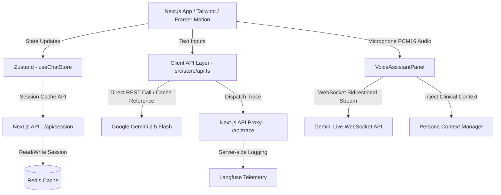
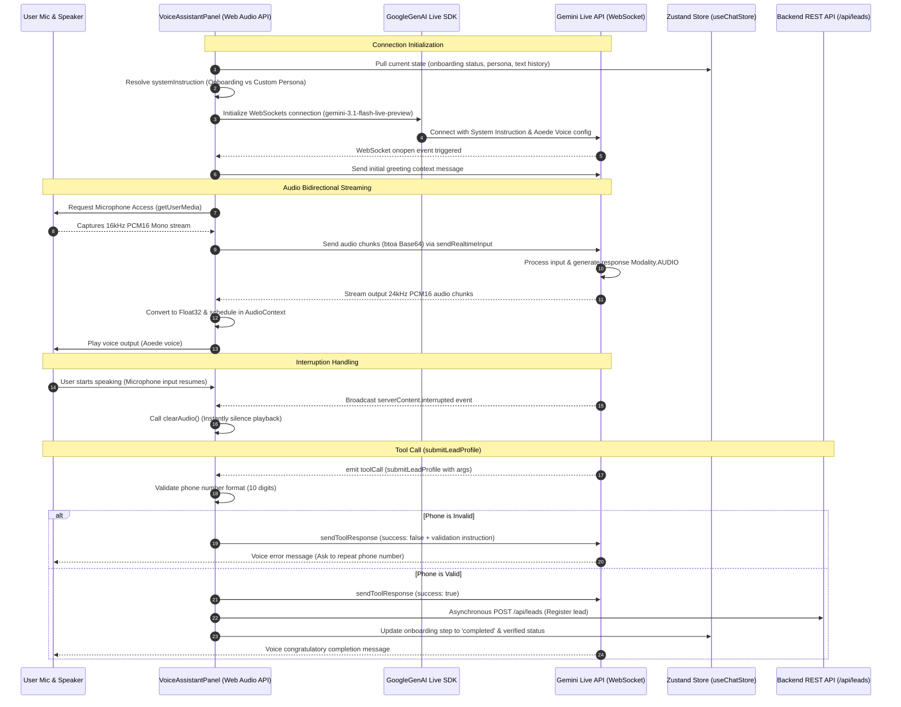

# YHealth AI — Conversational Metabolic & Wellness Assistant

YHealth AI is a premium, conversational metabolic and preventive wellness landing application. Drawing design inspiration from clean, minimalist interfaces (e.g., Claude AI), it delivers a high-trust conversational entry point for patient onboarding and health coaching.

The application combines a multi-stage clinical profiling state machine, context-caching optimizations to control API costs, real-time bidirectional WebSocket voice consultations, and secure server-side telemetry.

---

## 🏗️ System Architecture

YHealth AI leverages Next.js, Redis, and Google Gemini API (including standard LLM and Live API WebSockets) to orchestrate a fast, responsive, and secure experience.



---

## 🎙️ Deep-Dive: Real-Time Multimodal Voice Model Integration

The real-time voice assistant in YHealth AI is one of its core features. It enables hands-free, natural-sounding conversations with extremely low latency. Here is a detailed breakdown of how the voice model works, how it integrates, how it gets its persona, and the tools it utilizes.



### 1. Core Voice Model & SDK
* **Underlying Model**: The system utilizes **`gemini-3.1-flash-live-preview`**, Google's real-time multimodal model.
* **SDK**: Built using the official `@google/genai` library, utilizing the Multimodal Live API.
* **Protocol**: A bidirectional WebSocket connection, establishing low-latency, streaming-first audio interaction.
* **Output Voice Configuration**: Configured with the **`Aoede`** prebuilt voice (an expressive, human-like voice) with response modalities restricted strictly to `[Modality.AUDIO]`.

---

### 2. Connection & Integration Pipeline
* **Microphone Capture (Audio Input)**: 
  * Captures browser audio using `navigator.mediaDevices.getUserMedia` with echo cancellation, noise suppression, and auto gain control enabled.
  * Resamples the incoming stream to a **16kHz sample rate** using a Web Audio `AudioContext` and a `ScriptProcessorNode`.
  * The PCM 16-bit float array is normalized into a 16-bit integer buffer (`Int16Array`), converted to a base64-encoded string, and streamed to the Live API WebSocket via `session.sendRealtimeInput` in real-time.
* **Audio Playback (Audio Output)**:
  * Receives base64 PCM 16-bit audio chunks from the WebSocket at a **24kHz sample rate**.
  * Decodes base64 into a binary buffer, parses it as `Int16Array`, and scales it into a `Float32Array` (dividing by `32768.0` for normalization).
  * Schedules these buffers sequentially in a dedicated playback `AudioContext` (`playbackCtxRef`). This queuing mechanism ensures smooth, gapless audio playback.
* **User Interruption Handling**:
  * The system implements active barging. When the user speaks while the model is responding, Gemini detects the voice collision and sends a `serverContent.interrupted` socket message.
  * The frontend immediately invokes `clearAudio()`, terminating the active `AudioContext` buffer sources and resetting the play queue. This stops the assistant's speech instantly, creating a natural conversation flow.
* **Aesthetic Waveform Synchronization**:
  * Calculates the Root Mean Square (RMS) amplitude of both input and output audio blocks.
  * Feeds these values into a responsive canvas rendering loop. The waveform renders as a multi-layered, smooth sine wave that changes its height, frequency, and speed based on who is speaking and their volume.
* **Wake Lock Protection**:
  * Utilizes the Screen Wake Lock API via a custom `useWakeLock` hook to keep the browser active and prevent device sleep, which would otherwise close the WebSocket connection.

---

### 3. Dynamic Persona Injection
The Voice Assistant adapts its instructions, personality, and data context depending on the user's current session state:

#### A. Onboarding State (Not Yet Registered)
If the user hasn't completed onboarding, the assistant acts as a friendly registration counselor.
* **Dynamic Information Auditing**: The component checks the Zustand store (`onboardingProfile`) to see what information is already collected (e.g., Name, Age) and what is missing (e.g., Phone number, Gender, Health goal).
* **Targeted Collection Instructions**: It passes a tailored prompt listing only the missing fields:
  ```text
  You are YHealth AI Assistant. The user is in onboarding.
  Your job is to gather the following missing information:
  - Phone number
  - Gender
  - Health goal
  
  Already collected details (do not ask again):
  - Name: Vishal Kumar
  - Age: 28
  ```
* **Step-by-Step Gathering**: Instructs the model to ask for only one detail at a time, keeping it brief and conversational, avoiding overwhelment.

#### B. Registered Patient State (Custom Persona Loaded)
If the patient is already registered and verified, the `activePersonaManager` loads their medical history.
* **Clinical History Injection**: The `PersonaContextBuilder.buildContext` compiler evaluates the user's context and generates a clinical data block.
* **Personalized System Instructions**: Compiles patient metadata (Short, Detailed, and Executive summaries), lifestyle adjustments, glycemic trends (CGM, glucometer), current medications, laboratory records, and care team details.
* **Doctor Contextual Awareness**: Injects details about their assigned care team, instructing the voice assistant to reference their physician (e.g., "Dr. Samarth Gupta") by name when suggesting clinical consultation.

#### C. Guest / Default State
If onboarding is complete but no medical profile is loaded, it falls back to the baseline **`YHEALTH_PERSONA`** combined with campaign-specific prompts (derived from the user's `utm_campaign`).

#### D. Core Speech Persona Rules (`persona.ts`)
Across all states, the model is bound by the guidelines in `persona.ts`:
* **Indian English Dialect**: Speaks like a warm, educated Indian healthcare professional in English.
* **Decorum & Syntactical Styling**: Uses polite, respectful phrasings (e.g., *"Kindly tell me..."*, *"Please let me know..."*).
* **Common Indian Medical Terminology**: Translates clinical jargon into terms commonly used in India:
  * *"Acidity"* or *"gas"* instead of acid reflux.
  * *"Loose motions"* or *"upset stomach"* instead of diarrhea.
  * *"Giddiness"* instead of dizziness.
  * *"Tension"* instead of anxiety/stress.
* **Natural Speech Patterns**: Incorporates human-like thinking fillers (e.g., *"Hmm..."*, *"Uh..."*, *"Ah, I see"*) and occasional self-corrections (e.g., *"Actually, let me ask you first..."*), avoiding repetitive customer support patterns.
* **Response Length Constraints**: Strictly limited to 1-3 short sentences. Long explanations are discarded because they are hard to comprehend in a spoken-only interface.

---

### 4. Tool Integration & Lead Submission
The voice model is given access to functional tools to bridge the spoken conversation with backend states:

* **Registered Tool**: `submitLeadProfile`
* **When It's Used**: Only registered during the onboarding phase. Once the model collects the necessary details, it triggers this tool call.
* **Parameters**:
  * `name` (string)
  * `age` (integer)
  * `phone_number` (string)
  * `gender` (string)
  * `health_goal` (string)
  * `conditions` (array of strings)
  * `feeling_note` (string)

#### The Verification & Submission Flow:
1. **Phone Number Format Validation**: 
   * When Gemini invokes `submitLeadProfile`, the client intercepts the arguments and runs a normalization script. It strips spaces, country codes (such as `+91`), or leading `0` prefixes, leaving a clean 10-digit number.
   * Checks if it is a valid 10-digit Indian mobile number (matching `/^[6-9]\d{9}$/`).
2. **Handling Failures**:
   * If validation fails, the client sends a failure payload back to the WebSocket:
     ```json
     {
       "success": false,
       "error": "invalid_phone_number",
       "message": "The phone number is not a valid 10-digit Indian mobile number. Please apologise briefly and ask the user to repeat their correct 10-digit mobile number."
     }
     ```
   * Gemini reads this response and verbally requests the user to repeat their phone number.
3. **Handling Success**:
   * If validation succeeds, the client responds with a success status to the WebSocket, allowing Gemini to congratulate the user and welcome them.
   * Asynchronously, the frontend makes a POST request to `/api/leads` to register the patient, updates the Zustand store onboarding step to `'completed'`, verifies the user, and synchronizes the voice session transcripts with Redis.

---

## 🚀 Other Deep-Dive Technical Pillars

### 1. Text-to-Voice Context Synchronization
To maintain a continuous, multi-modal conversation thread:
* **Zustand State Extraction**: When the user opens the Voice Panel, the component extracts the active chat session's text messages from the Zustand store.
* **System Prompt Injection**: The last 10 messages of text history are serialized into a transcription block:
  ```text
  [User]: ...
  [Assistant]: ...
  ```
  This block is appended to the connection-level `systemInstruction` configurations, giving the Gemini Live WebSocket model full awareness of the preceding text conversation.
* **Aesthetic Transition Welcome**: Inside the connection's `onopen` callback, if a text history is detected, it triggers a custom prompt: *"User transitioned from text chat to voice. Acknowledge this transition and their latest point in the text chat in a warm, brief 1-sentence welcome."* This prevents generic, repetitive greetings.

### 2. Google GenAI Context Caching Heuristics
When a patient is verified, their entire clinical profile (clinical history, CGM glucose levels, laboratory results, active medications) is loaded. To optimize costs and latency:
* **Token Threshold Evaluation**: We evaluate the length of the system prompt plus clinical context. Since Gemini context caching requires a minimum threshold of 2,048 tokens, the app checks if the instruction length exceeds **8,500 characters** (roughly 2,100 tokens).
* **REST Caching Registry**: If the instruction length qualifies, we hit the `/v1beta/cachedContents` endpoint to register the cache resource, returning a `cacheName`.
* **Cache Reuse**: We save `cacheName` in an in-memory cache registry keyed by a hash of the system instructions. Subsequent user requests use the `cachedContent` ID parameter, saving up to 50% on input token costs for multi-turn chats.

### 3. Secure Langfuse Telemetry Proxy
Rather than exposing sensitive analytics keys to the client:
* **Next.js Server Endpoint**: Exposes `/api/trace` to process client-side events. This endpoint reads the private `LANGFUSE_SECRET_KEY` strictly on the server side.
* **LLM Hook Integration**: Every time a user gets a chat response (`fetchGeminiResponse`), completes a validator turn (`verifyUserData`), or triggers a landing page greeting (`fetchGreetingResponse`), a non-blocking `fetch('/api/trace')` post request is dispatched asynchronously.
* **Observed Metrics**: Tracks input/output transcripts, model configuration parameters, and the exact token usage breakdown (`usageMetadata`). It groups chat sequences under a single `sessionId` (linked to `activeChatId`) to help analyze multi-turn conversations.

---

## 📂 File-by-File Directory Guide

### Core App Layout & Entry
* **[`src/app/page.tsx`](file:///home/vishal_kumar/Desktop/yhealth-UI-chatbot/frontend/src/app/page.tsx)**: Main landing layout. Implements the Claude-style dynamic greeting engine, handles responsiveness breakpoints, and anchors the chat frame container.
* **[`src/app/globals.css`](file:///home/vishal_kumar/Desktop/yhealth-UI-chatbot/frontend/src/app/globals.css)**: Stylesheet containing theme transitions, customized glassmorphic variables, and keyframe animations.

### UI Components
* **[`src/components/ChatInput.tsx`](file:///home/vishal_kumar/Desktop/yhealth-UI-chatbot/frontend/src/components/ChatInput.tsx)**: The interaction capsule containing typing placeholders, quick action chips, and triggers for the voice panel.
* **[`src/components/ChatMessage.tsx`](file:///home/vishal_kumar/Desktop/yhealth-UI-chatbot/frontend/src/components/ChatMessage.tsx)**: Message bubble formatter. Formats code blocks, tables, and renders custom `[HealthCardsGrid: ...]` blocks as inline diagnostic grids.
* **[`src/components/VoiceAssistantPanel.tsx`](file:///home/vishal_kumar/Desktop/yhealth-UI-chatbot/frontend/src/components/VoiceAssistantPanel.tsx)**: Voice modal implementation. Manages Web Audio context pipelines, WebSocket streaming, and RMS canvas rendering.
* **[`src/components/persona.ts`](file:///home/vishal_kumar/Desktop/yhealth-UI-chatbot/frontend/src/components/persona.ts)**: Speech persona file instructing the model on rhythm, tone, filler words, and professional conversational habits.
* **[`src/components/TourTooltip.tsx`](file:///home/vishal_kumar/Desktop/yhealth-UI-chatbot/frontend/src/components/TourTooltip.tsx)**: Guided walk-through overlay highlighting chat options, voice inputs, and verification processes.

### State & API Integrations
* **[`src/store/chatStore.ts`](file:///home/vishal_kumar/Desktop/yhealth-UI-chatbot/frontend/src/store/chatStore.ts)**: Global Zustand store. Controls onboarding step machines, message indices, and manages Redis persistence calls.
* **[`src/store/api.ts`](file:///home/vishal_kumar/Desktop/yhealth-UI-chatbot/frontend/src/store/api.ts)**: API layer. Houses raw Gemini fetch calls, context caching check heuristics, and Langfuse tracing triggers.
* **[`src/store/campaign-config.ts`](file:///home/vishal_kumar/Desktop/yhealth-UI-chatbot/frontend/src/store/campaign-config.ts)**: Config maps storing taglines, CTA names, and welcome templates for specific programs (e.g., Diabetes, Hypertension).

### Clinical Patient Persona Layer
* **[`src/persona/PersonaManager.ts`](file:///home/vishal_kumar/Desktop/yhealth-UI-chatbot/frontend/src/persona/PersonaManager.ts)**: Controls retrieval, parsing, and modification of active patient files.
* **[`src/persona/PersonaContextBuilder.ts`](file:///home/vishal_kumar/Desktop/yhealth-UI-chatbot/frontend/src/persona/PersonaContextBuilder.ts)**: Formats clinical structures into markdown blocks for LLM system prompts.
* **[`src/persona/patientMock.ts`](file:///home/vishal_kumar/Desktop/yhealth-UI-chatbot/frontend/src/persona/patientMock.ts)**: Mock patient profile holding blood pressure trends, CGM reports, and active medications.
* **[`src/persona/parsers/`](file:///home/vishal_kumar/Desktop/yhealth-UI-chatbot/frontend/src/persona/parsers)**: Individual parsers extracting specific details (e.g., `cgm.parser.ts`, `labs.parser.ts`, `medication.parser.ts`).

### Infrastructure & Proxies
* **[`src/app/api/trace/route.ts`](file:///home/vishal_kumar/Desktop/yhealth-UI-chatbot/frontend/src/app/api/trace/route.ts)**: Langfuse server tracing proxy.
* **[`src/app/api/session/route.ts`](file:///home/vishal_kumar/Desktop/yhealth-UI-chatbot/frontend/src/app/api/session/route.ts)**: Saves and restores Zustand chat state to and from Redis.
* **[`Dockerfile`](file:///home/vishal_kumar/Desktop/yhealth-UI-chatbot/frontend/Dockerfile)**: Multi-stage Docker config packaging Next.js into a standalone build.
* **[`docker-compose.yml`](file:///home/vishal_kumar/Desktop/yhealth-UI-chatbot/frontend/docker-compose.yml)**: Orchestrator running Next.js and Redis.

---

## ⚙️ Environment Variables Reference

Configure these environment variables in your `.env` or `.env.local` file:

| Variable | Scope | Description | Example / Fallback |
| :--- | :--- | :--- | :--- |
| `NEXT_PUBLIC_GEMINI_API_KEY` | Client & Server | Google Gemini developer key for REST and WebSocket calls | `AIzaSy...` |
| `NEXT_PUBLIC_BACKEND_URL` | Client & Server | API base URL for fetching campaigns and clinical records | `http://localhost:8000` |
| `REDIS_URL` | Server Only | Redis connection string used for chat session synchronization | `redis://localhost:6379` |
| `LANGFUSE_SECRET_KEY` | Server Only | Private API credential used to authenticate with Langfuse | `sk-lf-...` |
| `LANGFUSE_PUBLIC_KEY` | Server Only | Public key used alongside secret key to tag trace streams | `pk-lf-...` |
| `LANGFUSE_BASE_URL` | Server Only | Datacenter URL for Langfuse cloud collections | `https://us.cloud.langfuse.com` |

---

## 🚀 Getting Started & Local Setup

### Running Locally

1. **Install Dependencies**:
   ```bash
   npm install
   ```
2. **Start a Redis Server**:
   Make sure Redis is running locally on port `6379`.
3. **Start the Next.js Dev Server**:
   ```bash
   npm run dev
   ```
4. **Access the App**:
   Navigate to [http://localhost:3000](http://localhost:3000) in your browser.

### Running with Docker

Deploy Next.js and Redis together with a single command:
```bash
docker compose up --build -d
```
The Docker setup:
* Launches a Redis cache server container in the background.
* Compiles the Next.js application into a production-optimized standalone build.
* Serves the application at [http://localhost:3000](http://localhost:3000).

---

## 🛠️ Troubleshooting

### 1. Microphone Access Errors
* If the Live Voice Panel fails with a media permission error, ensure you are accessing the app over `https://` or `http://localhost`. Browsers block microphone access (`getUserMedia`) on unencrypted HTTP channels.
* Ensure you have granted microphone permissions in your browser's site settings.

### 2. Context Caching Failures
* If you see `400 Bad Request` or caching errors in your server logs, ensure the prompt you are attempting to cache contains at least 2,048 tokens. The app uses an 8,500 character check to safeguard this, but very dense text might fall below the threshold.
* Check that your Gemini API key has access to the `/v1beta/cachedContents` endpoint.
