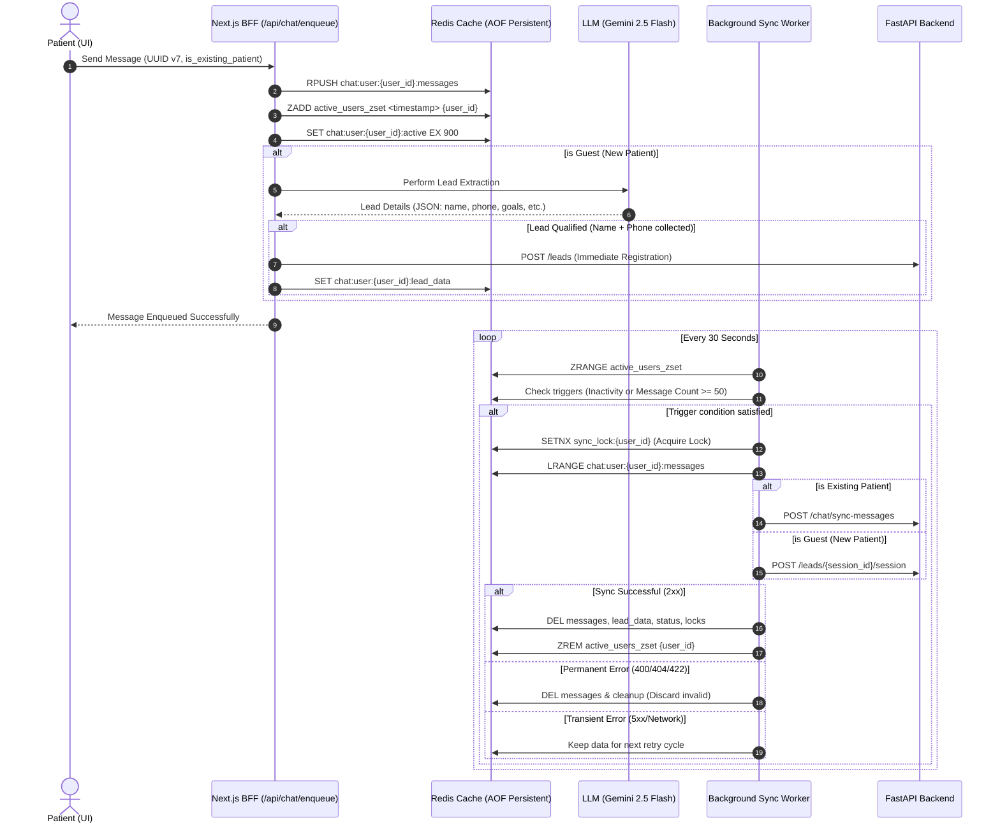

# YHealth Chat Synchronization & Lead Capture Architecture: Deep Dive

This document provides a highly detailed technical breakdown of how YHealth manages, buffers, and synchronizes chat sessions for **New Patients (Guest Users)** and **Existing Patients** using a hybrid Redis caching, background worker polling, and real-time LLM-based lead capture architecture.

---

## 1. High-Level Architectural Flow



---

## 2. Key Data Storage & Redis Schemas

Redis acts as the transient, durable caching layer. To ensure durability, Redis is configured with **AOF (Append Only File)** persistence (`--appendonly yes`), committing every write operation to disk to prevent data loss in the event of a container restart.

### A. Message Buffer (Redis List)
* **Key**: `chat:user:{user_id}:messages`
* **Data Structure**: `List` of serialized JSON strings.
* **Commands**: 
  * `RPUSH chat:user:{user_id}:messages <serialized_message>`
  * `LRANGE chat:user:{user_id}:messages 0 -1`
  * `DEL chat:user:{user_id}:messages`
* **JSON Schema**:
  ```json
  {
    "role": "user",
    "message": "Hello, I want to manage my hypertension.",
    "timestamp": 1781074660,
    "session_id": "018f972b-8a8b-7000-8000-000000000001"
  }
  ```

### B. Active Users Registry (Redis Sorted Set)
* **Key**: `active_users_zset`
* **Data Structure**: `Sorted Set` (ZSET). Members are `user_id` strings, and scores are the Epoch timestamp of the user's latest interaction.
* **Commands**:
  * `ZADD active_users_zset <current_epoch_timestamp> <user_id>`
  * `ZRANGE active_users_zset 0 -1`
  * `ZREM active_users_zset <user_id>`

### C. Active Session Status (Redis String)
* **Key**: `chat:user:{user_id}:active`
* **Data Structure**: `String` (value: `"true"`).
* **TTL**: 15 minutes (900 seconds). On every new incoming message, the key is refreshed.
* **Commands**:
  * `SET chat:user:{user_id}:active "true" EX 900`
  * `EXISTS chat:user:{user_id}:active`

### D. User Activity Timestamp (Redis String)
* **Key**: `chat:user:{user_id}:last_activity`
* **Data Structure**: `String` containing the Unix timestamp of the last message.
* **Commands**:
  * `SET chat:user:{user_id}:last_activity <timestamp>`

### E. Patient Classification Flag (Redis String)
* **Key**: `chat:user:{user_id}:is_existing_patient`
* **Data Structure**: `String` (`"true"` or `"false"`).
* **Commands**:
  * `SET chat:user:{user_id}:is_existing_patient "true"`

### F. Lead Extraction Cache (Redis String)
* **Key**: `chat:user:{user_id}:lead_data`
* **Data Structure**: `String` containing serialized JSON of the qualified lead details. Used to prevent duplicate registration requests and merge subsequent detail updates.
* **Commands**:
  * `SET chat:user:{user_id}:lead_data <serialized_lead_json>`
  * `GET chat:user:{user_id}:lead_data`

### G. Sync Mutual Exclusion Lock (Redis String)
* **Key**: `sync_lock:{user_id}`
* **Data Structure**: `String` (value: `"locked"`).
* **TTL**: 30 seconds.
* **Commands**:
  * `SET sync_lock:{user_id} "locked" NX PX 30000` (mutual exclusion lock)

---

## 3. Client Onboarding & Message Generation (`chatStore.ts`)

1. **UUID v7 Timestamps**: Every chat message is assigned a UUID v7 identifier generated locally or server-side.
   * **Why UUID v7?**: Unlike random UUID v4, UUID v7 is sequential and contains a millisecond precision timestamp in the most significant bits. This guarantees that messages remain in strict chronological order when synced or indexed in B-Tree database tables.
2. **BFF Endpoint Routing**: When a user inputs a message, instead of direct FastAPI database calls, the message payload is sent via a HTTP POST request to `/api/chat/enqueue`.
3. **Session Hydration**: When the UI loads a conversation history, it reads the persisted messages from local storage and sets `enqueued: true` on them to ensure the client doesn't re-enqueue legacy messages into Redis.

---

## 4. Message Enqueuing & LLM Lead Capture Pipeline

The `/api/chat/enqueue` Next.js route is the main gateway for incoming messages.

```text
[Incoming Message] ---> [Redis Buffer Store]
                           |
                     (Guest User?)
                        /     \
                      Yes      No ---> [Return Response]
                      /
            [Gemini Lead Extraction]
                      |
            (Name & Phone Present?)
                    /       \
                  Yes        No ---> [Return Response]
                  /
       [Merge Cache & POST /leads]
```

### A. Core Enqueue Handler
Upon receiving the payload, the BFF executes a Redis Transaction or Pipeline:
1. Pushes the message object to `chat:user:{user_id}:messages`.
2. Updates `chat:user:{user_id}:active` with an EX 900 TTL.
3. Sets `chat:user:{user_id}:last_activity` to the message timestamp.
4. Registers the user's latest score in `active_users_zset`.
5. Records the `is_existing_patient` flag.

### B. Proactive LLM Lead Extraction
If `is_existing_patient` is `false`, the BFF triggers the lead pipeline:
1. **Gemini 2.5 Flash Request**: Passes the conversation history text to the model with a strict system prompt:
   ```text
   Extract the following fields from the chat history:
   - name (string)
   - phone_number (string)
   - age (number, null if unknown)
   - gender (string, null if unknown)
   - health_goal (string, null if unknown)
   - conditions (array of strings, empty array if unknown)
   - program (string, null if unknown)
   
   Respond ONLY with a valid JSON object.
   ```
2. **JSON Parsing & Validation**: Sanitizes JSON Markdown code blocks (e.g. ` ```json ` tags) and parses the response.
3. **Qualification Threshold**:
   * If both `name` and `phone_number` are non-null and valid, the lead qualifies.
4. **State Caching and Merging**:
   * The route fetches the cached `chat:user:{user_id}:lead_data` from Redis.
   * If it exists, it performs a deep merge of new details (e.g. if the user later states their age, conditions, or goals).
   * If the merged lead contains new/updated information, it immediately sends a POST request to the FastAPI backend Lead Registration endpoint (`POST /leads`).
   * Updates the `chat:user:{user_id}:lead_data` Redis cache.

---

## 5. Background Sync Worker (`syncWorker.ts`)

A lightweight Node service runs continuously inside the Next.js container, polling every 30 seconds.

### A. Polling Loop Sequence
1. Fetches all active users from Redis: `ZRANGE active_users_zset 0 -1`.
2. For each user:
   * Checks the length of `chat:user:{user_id}:messages` via `LLEN`.
   * Checks the presence of the activity flag `chat:user:{user_id}:active` via `EXISTS`.
3. If `LLEN >= 50` **OR** `EXISTS == 0` (15 minutes of inactivity):
   * Initiates the synchronization process.

### B. Distributed Locking & Race Condition Prevention
To prevent multiple background worker instances from processing the same user's message queue simultaneously (e.g. in multi-container replica deployments):
* The worker runs: `SET sync_lock:{user_id} "locked" NX PX 30000`.
* If the key was already set, the worker skips this user and retries in the next iteration.

### C. Sync Routing & Payload Format
The worker fetches the buffered messages (`LRANGE`) and checks the `is_existing_patient` flag:

#### Case 1: Existing Patient
* **Target Endpoint**: `POST /chat/sync-messages`
* **Payload Structure**:
  ```json
  {
    "user_id": "6787e4d688a19b5546fe6f30",
    "session_id": "018f972b-8a8b-7000-8000-000000000001",
    "messages": [
      { "role": "user", "message": "My chest is hurting.", "timestamp": 1781074660 },
      { "role": "assistant", "message": "Please call emergency services if severe.", "timestamp": 1781074665 }
    ],
    "time": 1781074700,
    "chat": [
      { "user": "My chest is hurting.", "agent": "Please call emergency services if severe." }
    ]
  }
  ```

#### Case 2: Guest / New Patient
* **Target Endpoint**: `POST /leads/{session_id}/session`
* **Payload Structure**:
  ```json
  {
    "history": [
      { "user": "My chest is hurting.", "agent": "Please call emergency services if severe." }
    ]
  }
  ```

### D. Session UUID Sanitization
The worker sanitizes the parsed `session_id` using the `toValidUUID` utility before forming the backend URLs. This replaces any non-standard client session formats (e.g. "guest-session-123") with valid, structured UUIDs, preventing FastAPI backend validation from raising 422 validation errors.

### E. Error Resolution Policies
* **HTTP 2xx Success**: Clears the message list, deletes activity keys, removes the user from `active_users_zset`, and deletes the distributed lock.
* **HTTP 400/404/422 Permanent Client Errors**: Cleans up all user Redis keys immediately. This discards corrupt payloads and prevents stuck sync loops from hammering the backend APIs.
* **HTTP 5xx / Network Transient Errors**: Throws an exception. The message buffer is left untouched in Redis, allowing the next worker polling cycle to retry synchronization.
