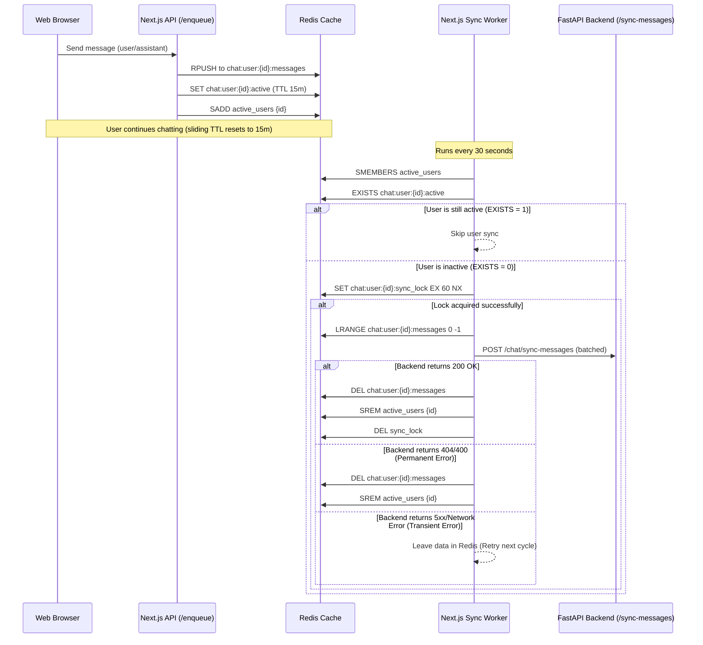

# 🔄 YHealth Redis-Based Chat Sync Batching Mechanism

To optimize performance and reduce database load on the FastAPI backend, the message persistence flow is split into an event-driven buffering phase and a lazy batch synchronization phase. Instead of calling `/sync-messages` on the backend after every message, chat messages are enqueued into a Redis cache and synced to the database in batches only when the user becomes inactive.

---

## 🏗️ Architecture Overview

The system consists of three main components:
1. **Next.js Client Enqueueing**: The user's browser pushes new user and assistant chat messages to a local Next.js `/api/chat/enqueue` endpoint instead of calling the FastAPI backend directly.
2. **Redis Cache Store**: Temporarily buffers chat messages, tracks last activity timestamps, manages a 15-minute sliding inactivity window (via Redis TTL), and registers all active users in a global Set.
3. **Background Sync Worker**: A single persistent Node.js thread running inside the Next.js server instance. It periodically checks the active user list and batch-syncs messages to the FastAPI backend for users whose activity timer has expired.



---

## ⚙️ Redis Key Design

The Redis layer organizes keys as follows:

| Redis Key | Type | TTL | Purpose |
| :--- | :--- | :--- | :--- |
| `chat:user:{user_id}:messages` | List | None | Holds JSON-serialized message history objects containing `role`, `message`, `timestamp`, and `session_id`. |
| `chat:user:{user_id}:active` | String | 900s (15m) | Active status flag. Every new message resets this key's TTL back to 15 minutes. |
| `chat:user:{user_id}:last_activity` | String | None | Stores the epoch timestamp of the user's last interaction. |
| `active_users` | Set | None | Global registry holding the user IDs of all users who have unsynced chat history. |
| `chat:user:{user_id}:sync_lock` | String | 60s | Distributed lock that prevents race conditions if multiple worker threads poll concurrently. |

---

## ⚙️ Detailed Execution Phases

### Phase 1: Client Message Enqueueing (`src/store/utils.ts`)
When the frontend chat store registers a new message:
1. It filters the messages to only enqueue those that are new:
   * The message must have a `created_at` timestamp.
   * The message must have been created within the last 15 minutes (`Date.now() - 15 * 60 * 1000`).
   * The message ID must not already exist in the local tracking Set (`yhealth_enqueued_message_ids` stored in `localStorage`).
2. It makes a POST request to `/api/chat/enqueue` with the payload:
   ```json
   {
     "user_id": "6787e4d688a19b5546fe6f30",
     "session_id": "b1739926-45d8-50e6-8f8d-badda88fed3b",
     "role": "user",
     "message": "Hello!",
     "timestamp": 1781005160
   }
   ```

### Phase 2: Next.js API Router Processing (`src/app/api/chat/enqueue/route.ts`)
The enqueue endpoint processes the incoming message:
1. Appends the message object to `chat:user:{user_id}:messages` using `RPUSH`.
2. Updates `chat:user:{user_id}:active` to `true` with a `900` second (15 minutes) expiration (`EX`).
3. Updates `chat:user:{user_id}:last_activity` to the current epoch timestamp.
4. Registers the `user_id` inside the `active_users` global Set using `SADD`.

### Phase 3: Background Worker Polling Loop (`src/lib/syncWorker.ts`)
The sync worker loop is initialized once per server instance and runs every 30 seconds:
1. It fetches all registered users from the `active_users` set using `SMEMBERS`.
2. For each user, it checks if the active key `chat:user:{user_id}:active` exists:
   * **If exists**: The user is active. No sync occurs.
   * **If does not exist**: The user has been inactive for at least 15 minutes. Sync process begins.
3. Attempts to acquire a distributed lock for that user using:
   ```bash
   SET chat:user:{user_id}:sync_lock true EX 60 NX
   ```
4. If the lock is successfully acquired, it retrieves all enqueued messages from the list using `LRANGE 0 -1`.
5. It shapes the messages into a format compatible with the FastAPI backend's Pydantic model (`session_id`, `user_id`, `messages`, `time`, and `chat` user-agent pairs).
6. It sends a `POST` request to the backend's `/chat/sync-messages` endpoint.

---

## 🛡️ Resilient Error Classification & Recovery

To prevent infinite retries and log pollution on mock/deleted sessions, the sync worker implements a strict error classification hierarchy:

### 1. Successful Sync (200 OK)
* **Action**: Clear all buffered data.
* **Execution**: Deletes the list `chat:user:{user_id}:messages`, removes the user from the `active_users` Set, deletes the last activity key, and frees the sync lock.

### 2. Permanent Client Errors (404 Session Not Found / 400 Bad Request)
* **Action**: Discard the invalid payload and purge the user from the cache.
* **Execution**: Wipes out `chat:user:{user_id}:messages` and removes the user from the `active_users` registry immediately. This prevents the worker from infinitely attempting to sync mock test accounts or invalid sessions.

### 3. Transient Server Errors (5xx / Network Failures)
* **Action**: Keep the data intact in Redis for recovery.
* **Execution**: The sync worker logs the warning but leaves the message queue and registry set untouched. The user will be picked up for another sync attempt during the next 30-second polling cycle.

---

## 🧪 Testing & Verification

A test endpoint has been provided at `/api/test/trigger-worker` to simulate the batch sync process:

```bash
curl -s http://localhost:3000/api/test/trigger-worker
```

**What the test does:**
1. Enqueues two mock messages for user `test_user_999`.
2. Manually deletes the active flag key `chat:user:test_user_999:active` to fake 15 minutes of inactivity.
3. Forces the background sync worker loop to run.
4. Confirms that the sync worker initiates a batch payload to the backend, receives a `404` (since the session ID does not exist in the backend DB), and successfully runs the permanent error cleanup logic (wiping out the mock keys from Redis).
